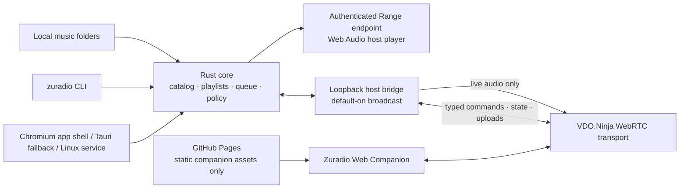

# Zuradio architecture

Status: implementation baseline, 2026-09-01.

## Invariant

The collection never leaves the laptop as hosted files. GitHub Pages serves the
static Zuradio Web Companion only. During a locally started broadcast, the
laptop emits a live WebRTC audio track. Stopping the laptop, daemon, host bridge,
or broadcast makes remote audio unavailable.

## Crate and adapter boundaries

- `zuradio-core`: domain types, SQLite repositories, scanner, playlists, queue,
  player reducer, access roles, grants, and fixed command/event schemas.
- `zuradio-daemon`: loopback HTTP/WebSocket interface, CLI client/server modes,
  local browser bootstrap, authenticated media Range/artwork responses, and
  remote grant enforcement.
- `web`: local host bridge and static companion. The VDO.Ninja SDK lives only
  here behind a small transport interface.
- `packaging/linux`: the installed systemd user service, application-menu entry,
  AppImage installer, and launchers.
- `apps/zuradio-desktop`: a thin Tauri v2/WebKitGTK shell. It first validates
  and reuses the protected runtime handshake of a healthy service; otherwise it
  starts `zuradio-daemon` in process. It exposes no Tauri IPC permissions,
  permits top-level navigation only to the packaged startup page and an exact
  `http://127.0.0.1:<port>/host/#bootstrap=…` URL, and never loads the hosted
  companion into a privileged WebView.

The installed Linux launcher prefers a dedicated Chromium app window over the
system WebKitGTK shell. WebRTC is a compile-time WebKitGTK feature and is absent
from some distribution builds even when the runtime setting exists. The
Chromium window uses a private Zuradio profile, enables unattended local audio,
and receives the same protected loopback bootstrap URL. Rust remains the sole
authority; Chromium is only the audio/UI/WebRTC adapter.

## One authority, many adapters

All mutations enter one serial Rust command handler. A command has an ID,
expected state revision, actor scope, and a closed action enum. Accepted commands
advance the revision and emit canonical state. Duplicate command IDs are safe to
retry. Stale writes receive a conflict plus a fresh snapshot.

The laptop operator is the highest-priority player authority. If a laptop player
command and a controller command race from the same observed revision, the local
command is rebased and applied after the controller command; the controller's
now-stale command is rejected when the local command arrives first. Seeks carry
the selected track ID as an additional precondition, so local priority can never
move a different track after a simultaneous remote track change. A later remote
command based on the newly published revision remains a valid new user action.

The CLI, desktop UI, and remote bridge share that contract. Remote messages can
never name a Rust function, executable, filesystem path, URL, or DOM operation.

## Player features

The persistent model covers tracks, artists, albums, playlists and ordered
playlist entries, favorites, play history, the active queue, shuffle/repeat
configuration, and last-known player state. Rebuildable scanner data is kept
separate from user-authored state. Canonical client snapshots contain only
currently playable tracks; unavailable database rows remain internal so saved
playlist and history references are not erased when a mount moves or a managed
file is migrated.

Remote uploads are transactional per file: the Rust daemon validates a declared
selection, accepts ordered 8 KiB chunks into a private staging directory, and
verifies each SHA-256 digest. Each verified file is parsed, moved into the
user-visible Music/Zuradio Library hierarchy, inserted into the catalog, and
published to open clients before the next file finishes. A disconnect discards
only incomplete staging data; completed originals remain available. Embedded
tags outrank folder/filename inference; persistent user overrides outrank both.
The broadcasting host renders acknowledged operations as a local transfer strip
with the current path, byte progress, percentage, and per-file catalogue count,
then preserves a completion or interruption result long enough for the laptop
operator to see it.

## Live audio bridge

Local playback remains authoritative. While broadcasting, the host browser loads
the same current track from an authenticated loopback Range endpoint, aligns to
the Rust command position when the selected track or timeline changes, and routes
it through Web Audio into a
gain node connected to both the laptop speakers and a
`MediaStreamAudioDestinationNode`. Only that destination stream is published;
the companion never receives a file URL or independent per-listener queue.

Between timeline commands, the media element's playback clock owns the live
position. Revisioned snapshots that only change volume, playlists, queue data, or
other state must not reapply an older position and rewind playback. A pending
laptop seek is held locally until Rust acknowledges the matching track and
position; stale transport projections cannot pull it backwards.

This duplicates decoding only while broadcasting. A later native capture/Opus
adapter can replace it without changing domain commands or remote authorization.

## Password proof and modes

Starting a broadcast creates:

1. a deterministic password-derived, data-only rendezvous route;
2. an unrelated high-entropy private control/data route; and
3. an unrelated high-entropy live audio route returned only after
   listen/control authentication.

The browser derives the rendezvous coordinates only after a mode button and
password gesture. A nonce-bound beacon returns the fresh private coordinates
over the exact peer data channel with WebSocket fallback disabled. Every
companion then proves the same local password with HMAC over a versioned
transcript that includes session, epoch, mode, peer ID, and nonce. Rust returns
a server proof and creates a short, revocable mode-scoped grant. Every
action/upload carries that random grant ID, its bound peer ID, and a strictly
increasing sequence. The browser sends an explicit goodbye when it disconnects;
transport UUID reuse cannot revoke or impersonate a newly authenticated grant.
Upload grants cannot
control or listen; listener grants cannot inspect the library or mutate it;
only listen/control receive the live audio route.

The first successful password proof can request a 24-hour trusted-browser
credential. Rust signs a device-ID and expiry claim with a persistent local
secret mixed with the current password-derived key. The companion stores that
signed token and deterministic rendezvous coordinates, but never the raw
password. A remembered browser authenticates each later session with a new
nonce-bound HMAC keyed by the signed token; Rust verifies the signature,
device, expiry, session transcript, and mutual server proof. Changing the
password changes the signing key and invalidates all prior tokens.

Discovery teardown, password-key derivation, and private control transport are
overlapped where their dependencies allow. Controller commands become
available as soon as mutual proof and the initial snapshot complete; the
secondary audio receiver connects without delaying the control surface. Direct
ordered WebRTC data channels carry commands without polling or proxy hops.

## Offline behavior

The web companion can load its static interface without the laptop. It must then
show `Laptop offline` and cannot browse a catalog, recover cover art, or play old
audio. No service worker caches media or authenticated API responses.
