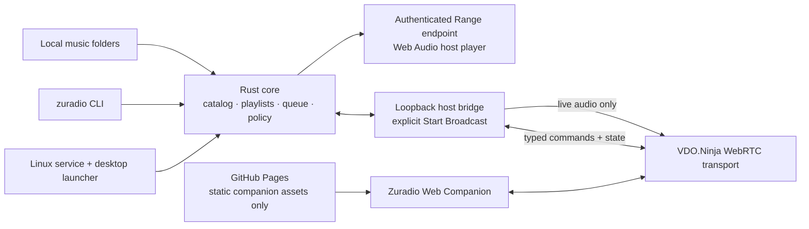

# Zuradio architecture

Status: implementation baseline, 2026-09-01.

## Invariant

The collection never leaves the laptop as hosted files. GitHub Pages serves the
static Zuradio Web Companion only. During a locally started broadcast, the
laptop emits a live WebRTC audio track. Stopping the laptop, daemon, host bridge,
or broadcast makes remote audio unavailable.

## Crate and adapter boundaries

- `zuradio-core`: domain types, SQLite repositories, scanner, playlists, queue,
  player reducer, access roles, grants, and fixed command/event schemas.
- `zuradio-daemon`: loopback HTTP/WebSocket interface, CLI client/server modes,
  local browser bootstrap, authenticated media Range/artwork responses, and
  remote grant enforcement.
- `web`: local host bridge and static companion. The VDO.Ninja SDK lives only
  here behind a small transport interface.
- `packaging/linux`: the installed systemd user service, application-menu entry,
  and launcher. A future Tauri shell must remain thin and must not introduce a
  second player or bypass the core's command boundary.

## One authority, many adapters

All mutations enter one serial Rust command handler. A command has an ID,
expected state revision, actor scope, and a closed action enum. Accepted commands
advance the revision and emit canonical state. Duplicate command IDs are safe to
retry. Stale writes receive a conflict plus a fresh snapshot.

The CLI, desktop UI, and remote bridge share that contract. Remote messages can
never name a Rust function, executable, filesystem path, URL, or DOM operation.

## Player features

The persistent model covers tracks, artists, albums, playlists and ordered
playlist entries, favorites, play history, the active queue, shuffle/repeat
configuration, and last-known player state. Rebuildable scanner data is kept
separate from user-authored state.

## Live audio bridge

Local playback remains authoritative. While broadcasting, the host browser loads
the same current track from an authenticated loopback Range endpoint, aligns to
the Rust-reported monotonic position, and routes it through Web Audio into a
gain node connected to both the laptop speakers and a
`MediaStreamAudioDestinationNode`. Only that destination stream is published;
the companion never receives a file URL or independent per-listener queue.

This duplicates decoding only while broadcasting. A later native capture/Opus
adapter can replace it without changing domain commands or remote authorization.

## Pairing and roles

Starting a broadcast creates unrelated high-entropy secrets for:

1. transport discovery;
2. controller transport;
3. controller application proof; and
4. listener transport/media access.

A link stores secrets in its URL fragment, which GitHub Pages never receives as
an HTTP request target. A controller proves possession with HMAC over a
versioned canonical transcript; Rust returns a server proof and creates a short,
revocable grant bound to session, epoch, role, and VDO peer ID. The grant remains
inside the trusted host bridge and every action also carries a strictly
increasing sequence. The listener link is a separate high-entropy capability for
a different VDO room that receives only live audio and sanitized now-playing
events; the listener UI and transport have no mutation path.

## Offline behavior

The web companion can load its static interface without the laptop. It must then
show `Laptop offline` and cannot browse a catalog, recover cover art, or play old
audio. No service worker caches media or authenticated API responses.
